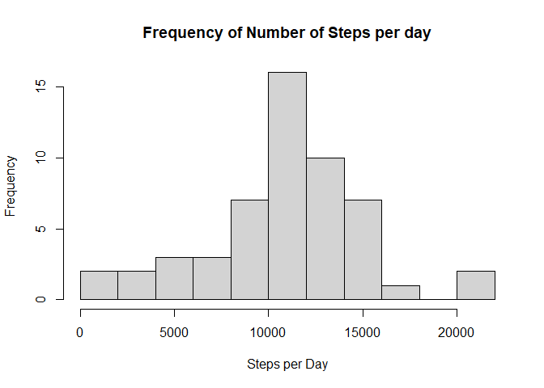
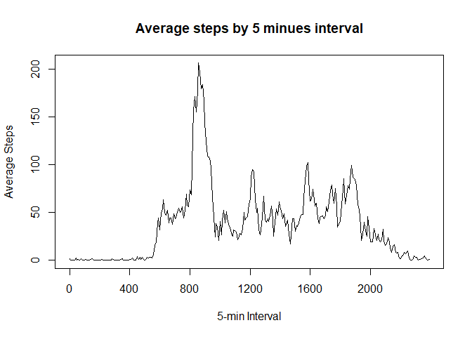
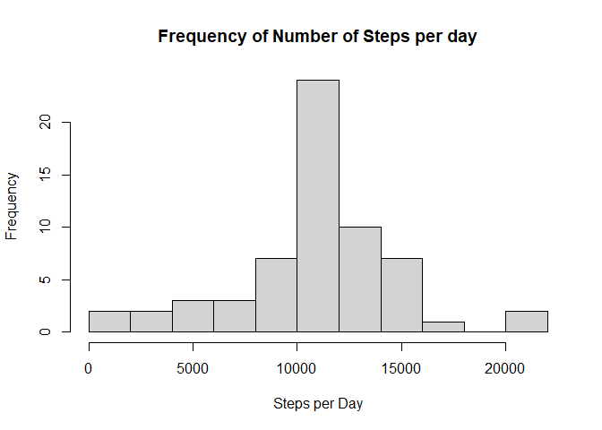
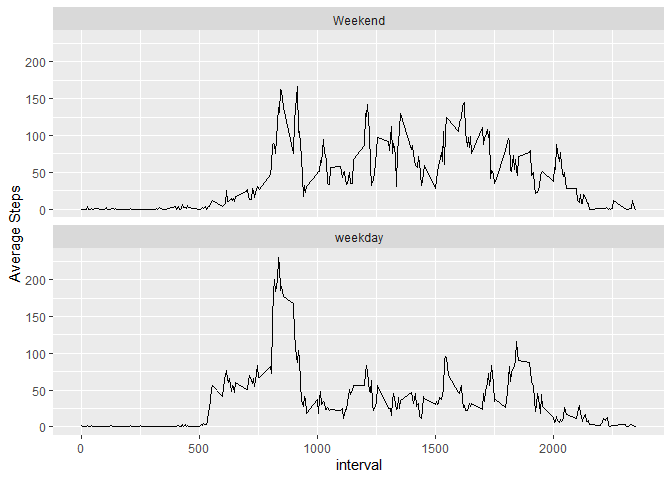

## Loading and preprocessing the data
As the file is zipped, we will use the function as argument into read.table

```r
data <- read.csv(unz("activity.zip", "activity.csv"), header=T)
head(data)
```

```
##   steps       date interval
## 1    NA 2012-10-01        0
## 2    NA 2012-10-01        5
## 3    NA 2012-10-01       10
## 4    NA 2012-10-01       15
## 5    NA 2012-10-01       20
## 6    NA 2012-10-01       25
```
Converting Date strings into R date format

```r
data$date <- as.Date(data$date,"%Y-%m-%d")
```

## What is mean total number of steps taken per day?
Let´s remove the NA values for this analysis

```r
sdata<-data[!is.na(data$steps),]
```
Calculating number of steps for each day

```r
steps_per_day<-tapply(sdata$steps, sdata$date, sum)
head(steps_per_day)
```

```
## 2012-10-02 2012-10-03 2012-10-04 2012-10-05 2012-10-06 2012-10-07 
##        126      11352      12116      13294      15420      11015
```
Creating the histogram

```r
hist(steps_per_day,breaks = 10, xlab = "Steps per Day", 
     main = "Frequency of Number of Steps per day")
```

<!-- -->


Sumarizing the mean and meadian total steps per day

```r
summary(steps_per_day)
```

```
##    Min. 1st Qu.  Median    Mean 3rd Qu.    Max. 
##      41    8841   10765   10766   13294   21194
```
## What is the average daily activity pattern?
Let´s calculate the average steps by each interval

```r
steps_per_interval<-tapply(sdata$steps, sdata$interval, mean)
head(steps_per_interval)
```

```
##         0         5        10        15        20        25 
## 1.7169811 0.3396226 0.1320755 0.1509434 0.0754717 2.0943396
```
Making a timeseries plot

```r
xnames <- names(steps_per_interval)
plot(steps_per_interval, type='l', xlab="5-min Interval",xaxt='n',
     ylab = "Average Steps",main = "Average steps by 5 minues interval")
axis(1,at = seq(1,288,by=48),labels=xnames[seq(1,288,by=48)])
```

<!-- -->

The time on which maximun number of steps occurs can be found by

```r
xnames[which.max(steps_per_interval)]
```

```
## [1] "835"
```

## Imputing missing values
Let´s Calculate and report the total number of missing values in the dataset 

```r
sum(is.na(data))
```

```
## [1] 2304
```
Create a new dataset with missing values replaced by the mean of that interval

```r
index<-is.na(data)
data2<-data
data2[index,"steps"]<-steps_per_interval[match(data[index,"interval"],xnames)]
```
Calculate the new steps by day with replaced missing values and build the histogram

```r
steps_per_day2<-tapply(data2$steps, data2$date, sum)
hist(steps_per_day2,breaks = 10, xlab = "Steps per Day", 
     main = "Frequency of Number of Steps per day")
```

<!-- -->

The histogram looks like excalty the same shape as before,but with higher frequencies.
Let's summarize both data with and without missing values to see  the differences

```r
summary(steps_per_day)
```

```
##    Min. 1st Qu.  Median    Mean 3rd Qu.    Max. 
##      41    8841   10765   10766   13294   21194
```

```r
summary(steps_per_day2)
```

```
##    Min. 1st Qu.  Median    Mean 3rd Qu.    Max. 
##      41    9819   10766   10766   12811   21194
```

```r
## Show in a Table
data.frame(Mean = rbind(mean(steps_per_day),mean(steps_per_day2)),
               Median = rbind(median(steps_per_day),median(steps_per_day2)),
               row.names = c("w/NA","w/o NA"))
```

```
##            Mean   Median
## w/NA   10766.19 10765.00
## w/o NA 10766.19 10766.19
```
We can see that there is no significant difference if we include the mean values of the time interval as missing data. As expected the mean is still de same, and a slightly change on Median Values 

## Are there differences in activity patterns between weekdays and weekends?

Let´s create a factor with two levels, for weekdays and weekdends

```r
weekends <- c("Saturday","Sunday")
data2$Weekdays<-factor(weekdays(data2$date) %in% weekends,
                       labels = c("Weekend","weekday"),
                       levels = c("TRUE","FALSE"))
summary(data2$Weekdays)                       
```

```
## Weekend weekday 
##    4608   12960
```
Let´s aggregate data into weekdays and time intervals.

```r
data3<-aggregate(list(Mean = data2$steps),
                 by=list(interval=data2$interval,week=data2$Weekdays),
                 FUN = mean)
```

Let´s make a plot using ggplot2

```r
library(ggplot2)
ggplot(data3,aes(interval,Mean))+facet_wrap(week~.,nrow=2 )+geom_line()+
labs(y = "Average Steps")
```

<!-- -->
